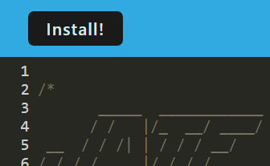
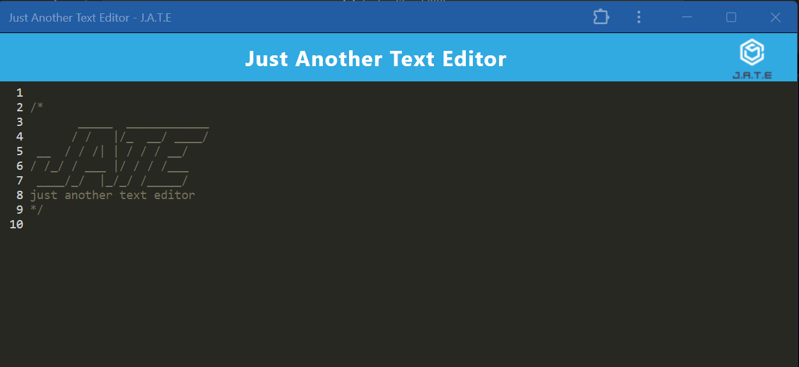

# J.A.T.E. (Just Another Text Editor) AKA Text Editor 5000

## Description

JATE is a PWA that allows users to take notes with Javascript syntax highlighting. JATE utilizes Code Mirror and Express to provide a simple text editor to create a PWA that can be downloaded and used offline.

The app is deployed on Heroku and can be accessed [here](https://text-editor-5000-f2edb74933f9.herokuapp.com/).

## Table of Contents

- [Installation](#installation)
- [Usage](#usage)
- [License](#license)
- [Questions](#questions)

## Installation

To install locally, clone the repo and install the necessary dependencies, by running the following command:
`npm install` or `npm i`.

To install the app as a PWA, click the download button in the address bar of your browser or the Install button at the top of the page.

## Usage

To run the application locally, clone the repo, then run the following command:
`npm run start`

To use the application as a PWA, click the download button in the address bar of your browser or the Install button at the top of the page. Then, begin typing in the text editor and your notes will be saved for future use. The application can be used offline, and will sync with the server when the application is online again.

Otherwise, the application is deployed on Heroku and can be accessed [here](https://text-editor-5000-f2edb74933f9.herokuapp.com/).

## License

This project is licensed under the ISC license.

## Questions

If you have any questions about the repo, open an issue or contact me directly at [galyenb@vcu.edu](mailto:galyenb@vcu.edu). You can find more of my work at [SeeYouThursday](https://github.com/SeeYouThursday/).
